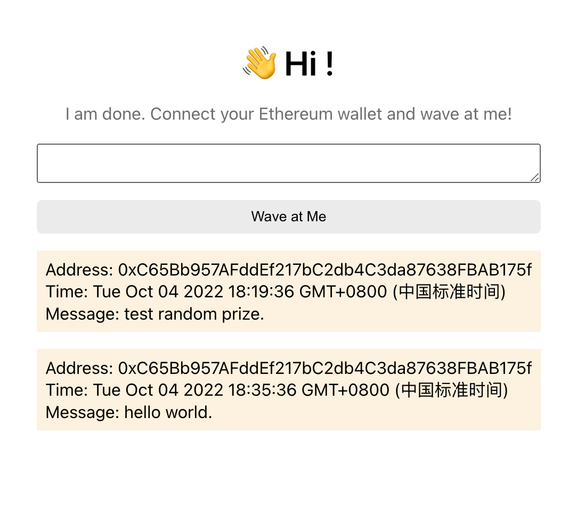

# WavePortal Dapp Project

building a website that I'll be calling the WavePortal --- it'll be a place where anyone on the internet can learn a little about who you are and send you a 👋 + a message and have that data saved on the blockchain through an Ethereum smart contract.

### Try running some of the following tasks:

```shell
npx hardhat help
npx hardhat test
REPORT_GAS=true npx hardhat test
npx hardhat node
npx hardhat run scripts/deploy.js
```

### Run test case
```shell
npx hardhat run scripts/run.js
```

### Deploy contract
```shell
npx hardhat run scripts/deploy.js --network goerli
```

### Open source
```shell
npx hardhat verify {contract_address} --network goerli
```

### Project url
```
https://waveportal-starter-project.jiashuaichang.repl.co/
```

### Screenshot

